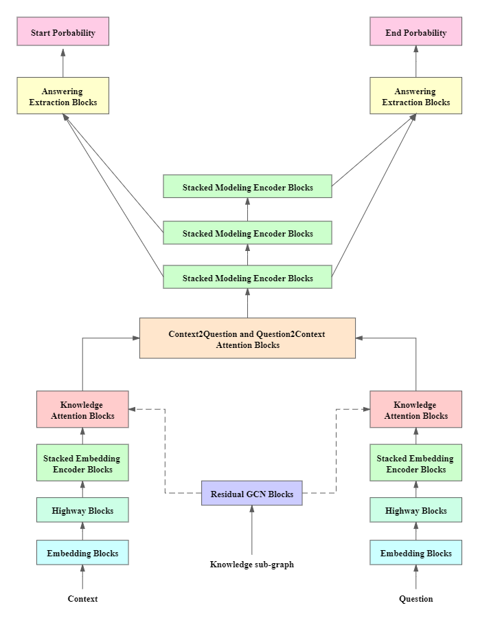

# KnowGQA
Question Answering model with SQuAD2.0. (Stanford University CS224N default project)
The starter code is forked from https://github.com/minggg/squad

Stanford University CS224N course websit:http://web.stanford.edu/class/cs224n/

course video of Winter 2019:https://www.youtube.com/playlist?list=PLoROMvodv4rOhcuXMZkNm7j3fVwBBY42z

## 1.Introduction
In this work, we proposed KnowGQA to integrate extra knowledge graph information into the question answering system using GCN and knowledge attention. We retrieve the knowledge graph data for each word entity and its related edges from ConceptNet[1] and build knowledge sub-graph for each context and generate knowledge representation using GCN. Such representation is then be integrated into question answering system using knowledge attention. The knowledge attention mechanism can be used in any question answering system. Here, we combine knowledge attention with QANet train the combined model in SQuAD 2.0 dataset. Results show that the extra knowledge extensively improve the performance of QANet in SQuAD 2.0, which prove the ability of our framework.

## 2. Run the code
First, **cd** to repository file and type ` conda env create -f environment.yml ` to create conda environment. 
Run `source activate squad `. 
If you only want to explore BiDAF and QANet model, run `python setup.py`. If you want to explore KnowGQA, also run `python setup.py --add_knowledge_graph=True` 
We integrate four model in the this project: BiDAF_nochar, BiDAF[2], QANet[3] and KnowGQA. The BiDAF_nochar is the default BiDAF without char embedding. To test each model, type following: 
BiDAF_nochar: `python trian.py -n=BiDAF_onchar --model_name=BiDAF_nochar --hidden_size=100` 
BiDAF: `python trian.py -n=BiDAF --model_name=BiDAF --hidden_size=100` 
QANet: `python trian.py -n=QANet --model_name=QANet --hidden_size=128 --h=8 --batch_size=16` 
KnowGQA:`python trian.py -n=KnowGQA --model_name=KnowGQA --hidden_size=96 --h=1 --batch_size=16` 

## 3. Model Structure

## 4. Results

| **Model**     | **F1**    | **EM**    | **AvNA**  |
| ------------- | --------- | --------- | --------- |
| BiDAF-nochar  | 61.52     | 57.89     | 68.56     |
| BiDAF-char    | 64.55     | 60.91     | 71.08     |
| QANet-small   | 65.64     | 62.21     | 71.7      |
| QANet-large   | 68.57     | 64.95     | 74.72     |
| KnowGQA-small | 67.25     | 64.29     | 72.86     |
| KnowGQA-large | **69.77** | **66.46** | **75.11** |

Table 1 shows the EM and F1 result for each model in modified dev dataset. Notice that BiDAF-nochar is the baseline model in CS224 project starter code. The only difference between BiDAF-char and BiDAF-nochar is that the former combine char embedding, which is the default BiDAF in original paper. Compare KnowGQA-small and QANet-small, we can see that the F1 and EM score increased by **1.61** and **2.08** respectively after we integrate extra knowledge into model. Meanwhile, the F1 score and EM score of KnowGQA-large increased by **1.2** and **1.51** respectively compare to QANet-large. 

## 5. Report

For detail model structure and experiment, you can read my [report](KnowGQA.pdf).

## Acknowledgment 

Thank for Stanford University and teacher group of CS224N for providing such wonderful course and online-free material. It really helps me learn both fundamental and state-of-art techniques in NLP field, which also inspired me the interest to explore more in this field. Meanwhile, thanks for the starter code in this default project.

## Reference
[1]R. Speer, J. Chin, and C. Havasi, ConceptNet 5.5: An Open Multilingual Graph of General Knowledge. 2019. 
[2]M. Seo, A. Kembhavi, A. Farhadi, and H. Hajishirzi, “Bidirectional Attention Flow for Machine Comprehension,” Nov. 2016, Accessed: Aug. 22, 2020. [Online]. Available: https://arxiv.org/abs/1611.01603. 
[3]A. W. Yu et al., “QaNet: Combining local convolution with global self-attention for reading comprehension,” 2018.